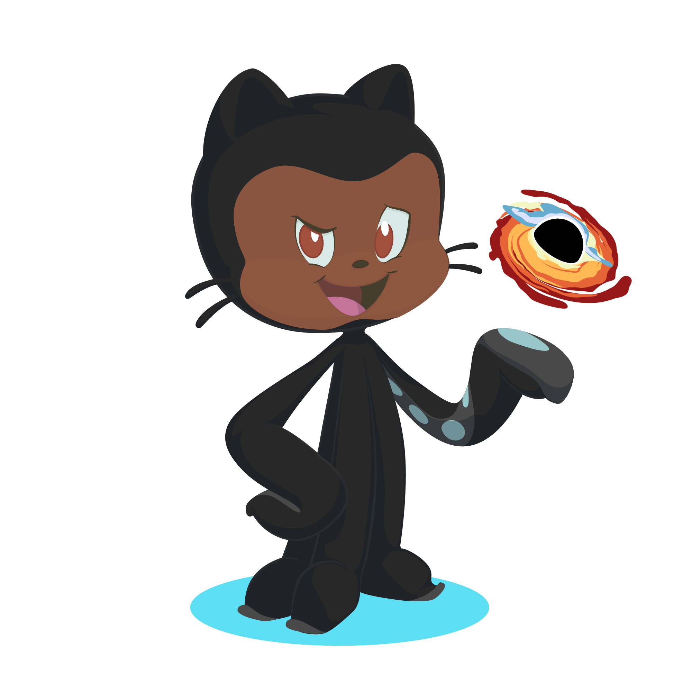

# Hi there 👋 
### My name is Joshua and you're welcome to my Github profile!

I'm currently studying computer science, an area that I just think is amazing!

## My Skills

  
  
  
  
  
  
  
  

## I'm Learning...

  

## GitHub Stats

  <a href="https://github.com/josh662">
  
  

## Contacts

  
  
     

